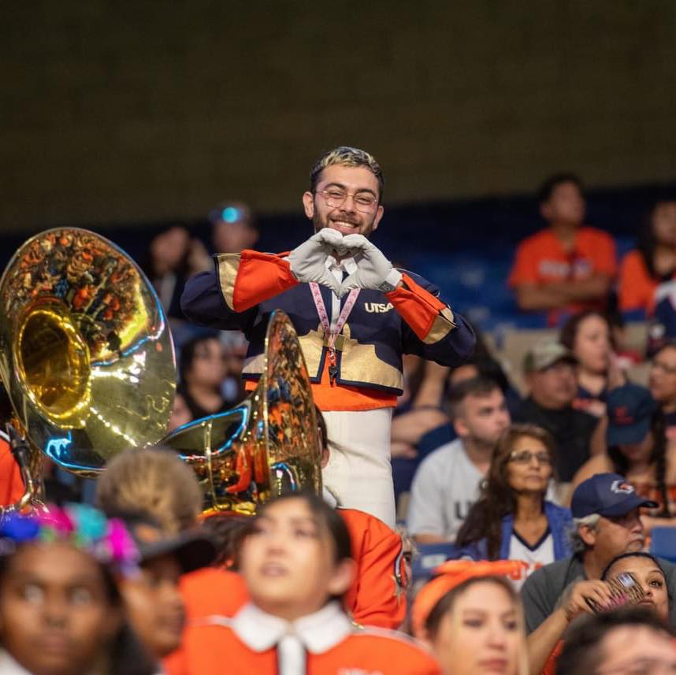
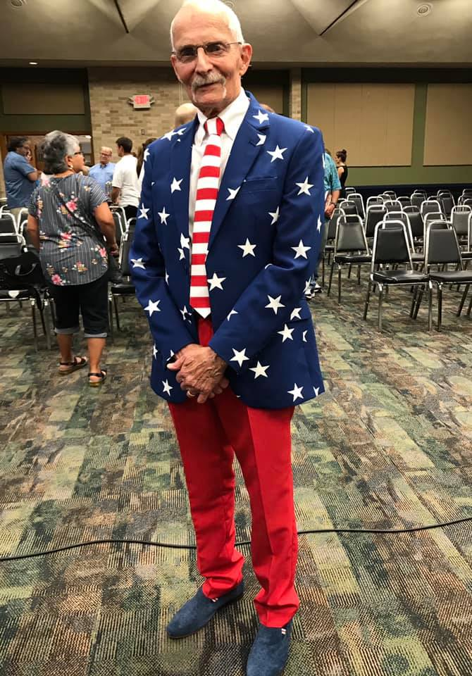

# About

Province 9 is a regional division of the Phi Mu Alpha Sinfonia Fraternity, located
in Central and South Texas. 

## Leadership
Leadership at the Province level is a mixture of appointed alumni and elective
active brothers. The Province Governor and Deputy Province Governor are appointed
by the National President. The Province Alumni Coordinator is then appointed by 
the Province Governor.

Because of the size of the Province, Province 9 has two dedicated Assistant Collegiate Province Representatives (ACPRs), one for the North and one for the South.

### Province Governor - Shawn Lewis
{: style="height:200px;width:200px" align=left}

Shawn Lewis is an accomplished conductor, arranger, and musician originally 
from San Antonio, Texas. A variety of impressive accomplishments and 
experiences mark his musical journey.

During his musical journey, Shawn Lewis had the privilege of performing with a 
plethora of prestigious musical groups. Notable Latin Music ensembles among 
the set include M, the award-winning "Mariachi Aguila" of Brackenridge High 
School in San Antonio, Texas, Texas State Mariachi Nueva Generación ,and a 
Latin Jazz group under the direction of percussion composer Alice Gomez. In 
addition, he played trumpet and piano in both Salsa ensembles, Orquestra Del 
Rio and Salsa Del Rio.

Shawn further honed his skills by studying Choral conducting with Dr. Jonathan 
Babcock and participated in Texas State's vocal ensembles, University Singers, 
and Men's Chorus. 

In the realm of orchestral music, Shawn Lewis demonstrated exceptional 
proficiency, holding positions as a trumpeter in the Texas State Symphony 
Orchestra, the S.M.A.R.T Orchestra, the University of Incarnate Word Symphony, 
and the Phi Mu Alpha Sinfonia National Orchestra. He also played the French 
Horn and Trumpet in San Antonio College's Orchestra, Brass Choir, and the Wind 
Ensemble at Texas State.

As a commercial musician, Shawn contributed his talents to various local 
productions of Broadway classics, including "Beauty and The Beast," 
"Hairspray" "The Phantom of the Opera," "Fiddler on the Roof," and "Into The 
Woods."

Beyond performance, Shawn is a distinguished arranger, crafting musical 
compositions for high school bands, orchestras, and choirs in and beyond 
Central Texas.

His professional journey led him to Austin, where he worked at Meta for three 
years before eventually deciding to pursue a music education degree in Corpus 
Christi at Texas A&M. 

Shawn's commitment to Phi Mu Alpha Sinfonia is evident in his extensive 
involvement, having pledged in the fall of 2010 with the Epsilon Iota class of 
the Gamma Phi Chapter.  He assumed vital committee head roles within the 
organization, overseeing brotherhood, social activities, and alumni relations. 
His leadership extended to the executive board, where he held positions such 
as Alumni Relations Officer, President, and Music Director, winning talent 
shows and national competitions. He also contributed significantly to the Rho 
Epsilon Chapter, focusing on alumni relations and revitalizing these 
connections as Alumni Relations Officer. 

Shawn has held several pivotal roles at the province level, including Music 
Director and Province Alumni Coordinator, in which he currently serves as the 
Music Director, Social Media Manager, and Province Governor. His dedication 
and leadership were further recognized when he was nominated for the 6 and 
3-year term for committeeman at large at a national level and served as the 
assistant for the Men of Song Select chorus. Through his involvement with Phi 
Mu Alpha, Shawn Lewis has gained opportunities, found a true family, and 
formed bonds with an ocean of fraternity of brothers. He is committed to 
embodying the spirits of Support, Concord, Loyalty, Love, and Trust within the 
province, ensuring that the province remains a beacon of love and 
encouragement for every brother who seeks it.

_All Hail_

### Deputy Province Governor - Mason Egger
{: style="height:200px;width:200px" align=left}

Mason was initiated at Gamma Phi with 7 other brothers as part of the Epsilon 
Nu class in the Fall of 2012. During his time as an active he served on various
committees and was the Alumni Relations Officer twice; once as an active in 
2013-2014 and again as an alumni in 2016-2017. He graduated from Texas State
University in the Fall of 2015 with dual degrees in Computer Science and Music.

Mason is currently Sr. Technical Curriculum Developer at Temporal.io who 
specializes building community, developer-focused educational content, 
distributed systems, and Python. Prior to his work at Temporal he launched 
Developer Relations at Gretel.ai as the Lead Developer Advocate, and was a 
Developer Advocate at DigitalOcean specializing in Infrastructure-as-a-Service 
technologies. His engineering experience includes time as an Site Reliability
Engineer helping maintaining Expedia's cloud as well as a role working in 
Cyber Security for a Raytheon company. He's an avid programmer, speaker, 
educator, and writer/blogger. He is an organizer of the PyTexas Conference, 
Meetup, and is  President of the PyTexas Foundation. He actively contributes 
to open source projects, mostly surrounding PyTexas and the Python programming
language. In his spare time, he enjoys reading, camping, kayaking, and 
exploring new places.

To read more, check out his website [mason.dev](https://mason.dev)

### Province Alumni Coordinator - Chirs Silva
{: style="height:200px;width:200px" align=left}

Hello Brothers, 

I am Chris Silva, your Province Alumni Coordinator. I was
initiated in Fall 2006 at Kappa Chi at Del Mar College. At KX, I served as
FEO before transferring to TAMUCC with Rho Epsilon and serving as FEO
and as President. I also served one year as ACPR South. I didn’t graduate
from TAMUCC as I moved to San Antonio, but I eventually completed my
B.S. in Information Technology through an online institution. I landed a
job at Rackspace and worked until I landed my current job with A Cloud
Guru (A Pluralsight Company). I am part of the team that creates and
updates training content for AWS, Azure, and Google Cloud, along with
DevOps and Security. If you’re familiar with the company, you’ve heard my
voice and learned how to do various things across these disciplines from
my videos.

As a Collegiate Brother, I always enjoyed spending time with the Brothers and travelling around. I attended Leadership Institute twice (once in Nashville 
and once in Evansville) and National Convention 2009 in Orlando. Some of the 
best Brotherhood Development I’ve experienced has been in those 20+ hour car 
rides across the country! As your PAC, I hope to be a resource for the AROs in 
developing strong Alumnirelations. I was nervous but excited about the 
opportunity when Shawn asked me to be PAC. The Fraternity has had its fair 
share of setbacks over the last few years, and rebuilding trust and confidence 
in the organization within our Alumni base is of utmost importance as this 
body makes up the vast majority of the organization. I want to help the AROs 
develop strategies and create opportunities for strong Alumni engagement to 
rebuild trust and confidence in the organization and help rekindle Sinfonia’s 
fire within our Alumni Brothers. While my focus is on Alumni Relations, I am 
available as a resource to any Brothers in need. Please don’t hesitate to 
reach out if you need anything, have questions, or want to chat or get the
opinion of some old guy. 

_Fraternally, Chris Silva, KX ‘06 PAC_

### Collegiate Province Representative - Victor Briseno
{: style="height:200px;width:200px" align=left}

Hello Brothers! 

My name is Victor Briseño and I am a master’s student at Texas State 
University and an award-winning mariachi/opera vocalist hailing from 
Kingsville, TX. While pursuing my bachelor’s degree, I heard about Phi Mu 
Alpha, a fraternity aligned with my values and aspirations, and felt a strong 
calling to join. In the Spring of 2021, I crossed and joined the ranks of the 
distinguished Gamma Phi Chapter with the class of Zeta Zeta. Soon after, I 
adeptly fulfilled the roles and responsibilities of the Fraternal Education 
Officer (FEO), Assistant Fraternal Education Officer (AFEO), Treasurer, 
Fundraising Committee Head, and Brotherhood Committee Head. I have also, over 
my course of time, served on every committee in my chapter and actively work 
on increasing intraprovincial relationships by making lifelong friends in 
other chapters.

Recently acclaimed as the elected Chapter Province Representative (CPR) for 
Province 9, I stand poised to become a recognizable and approachable 
figurehead, a pillar of support and guidance for my fellow brothers and 
chapters. In this role, I envision amplifying the interactivity within the 
province, facilitating meaningful exchanges, building chapter leaders, solving 
looming or worrisome issues, and collaboratively charting the course for the 
province's collective journey beyond the challenges posed by the pandemic. I 
am beyond excited to work for the Province Council, but truthfully I am more 
enlivened by the mere fact that I get to serve the brothers of the prestigious 
and powerful Province 9. Please do not hesitate to reach out to me if there is 
anything I can do to help you or your chapters. You can find all my socials 
down below.

_On And Ever Upwards,_

_Victor M. Briseno - Collegiate Province Rep. of Province 9_

### Assistant Collegiate Province Representative (North) - Richard Daul
{: style="height:200px;width:200px" align=left}

Richard Daul is a senior at the University of Texas at San Antonio, pursuing a 
major in Music Marketing alongside minors in Business and Jazz. As the Head 
Drum Major for the Spirit of San Antonio marching band,

Richard's musical talents extend beyond conducting, as he is primarily 
recognized for his skillful trumpet playing. In recent years, he has directed 
his passion toward jazz piano, delving into its complexities and nuances. 
Richard's leadership shines as he holds the distinguished position of 
President within the Nu Eta chapter of Phi Mu Alpha Sinfonia. Additionally, he 
takes on the role of ACPR-North for Provence 9 Further showcasing his 
dedication to music and community engagement.

Beyond his musical endeavors, Richard is an ardent advocate for the 
environment and public transportation. His love for climbing, commitment to 
maintaining a healthy diet, and overall enthusiasm for fitness underscore his 
well-rounded and active lifestyle. With great enthusiasm, he eagerly embraces 
his upcoming role as ACPR-North for the esteemed Phi Mu Alpha chapter of 
Province 9. 

Go Runners!

### Assistant Collegiate Province Representative (South) - Austin Catache

## History

## Past Leadership

### Past Governors

#### Robert Whalin: September 23, 1935 - May 9, 2023
{: style="height:400px;width:300px" align=left}

Dr. John Robert Whalin of San Marcos, Texas passed away on May 9, 2023. He was
born in Bloomington, Illinois on September 23, 1935. He was preceded in death 
by his parents, Oren Leslie Whalin and Pearle Dennison Whalin, and his sister 
Mary Lois Major. He is survived by his wife of 62 years, Mary Whalin; son
and daughter-in-law Brent and Dianna Whalin; daughter, Kimberly Whalin Lock; 
and his grandsons Gene, Ryan, Sean, and Jayce. Dr. Whalin,“Bob”, moved to San 
Marcos in 1964 to teach piano at Southwest Texas State University. During his 
tenure, he travelled extensively as a classical concert pianist. He was an 
active leader and province governor with Phi Mu Alpha Sinfonia for over 20 
years and received the Robert J. Rogers lifetime service award. He was also 
awarded the faculty senate award for excellence in teaching in 1990 and 1995. 
He retired in 2001 and went on to teach at Austin Community College for 10 
years and teach private lessons into his 80s. Bob was an active San Marcos 
Rotary Club member for 30 years. He was also the choir director at the 
Presbyterian church in New Braunfels, TX. He loved Austin Symphony concerts 
with his wife, hosting gatherings at their home in San Marcos, and attending 
his grandsons’ sports and music performances. He was a dedicated father and 
proud grandfather who would build an entire Christmas village in the den every 
year. He was loved and will be missed by so many.

#### Matthew Trevino
{: style="height:300px;width:300px" align=left}

Matthew Trevino is in his 14th year teaching elementary music, and his 9th 
year teaching the amazing students at Roan Forest Elementary. Trevino was a 
semifinalist for the 2018 and 2022 Music Educator GRAMMY and is currently on 
the GRAMMY race as a quarterfinalist for the 5th time. Since establishing his 
percussion group Sonido in 2015 the group Sonido was invited to perform at the 
opening ceremonies of the 2017 AOSA Conference in Fort Worth, Sonido was an 
“invited ensemble” for the 2020 TMEA Convention where they tore the roof off 
of the house! They have since performed at the Tobin Center, performed for 
STOMP! Performed for the Spurs, the San Antonio HS All Star Game at the 
Alamodome, and for countless other performances.

_#goroanforestgo_

#### David Irving
{: style="height:400px;width:300px" align=left}

A native of Corpus Christi, earned his bachelor's and master's degrees at 
North Texas State University (now the University of North Texas). A guitarist 
from the age of four, he went through high school and college disguised as a 
French horn player. He began his teaching career with a three-year stint as 
the school band director for the Central-Texas community of Mart. It was there 
that he started his first school jazz band, learning along with his students 
and staying slightly ahead of them by reading each lesson of the group's class 
method book the night before he introduced it to the band. Apparently it 
worked; during the band's first year of existence it placed at the 
then-prestigious Brownwood Stage Band Festival. In his six years as band 
director in Ingleside, he regularly produced first-division concert, marching, 
and jazz bands. The jazz band he started there was the first public-school 
stage band in South Texas to rehearse on a daily basis. He came to Del Mar 
College in 1972. During his tenure at the school, the jazz bands have 
performed with many of the greatest names in jazz. In 1987, the MWF Jazz Band 
toured Europe, appearing at Holland's North Sea Festival and Switzerland's 
Montreux Festival. In addition to his duties as jazz band director, Irving 
teaches jazz appreciation, the history of rock music, and beginning guitar. He 
has recently completed work on his guitar class method, titled Learn To Play 
the Guitar in Three Easy Lessons (and Twenty Hard Ones). Irving is a member of 
Phi Mu Alpha Sinfonia, the national fraternity for men in music, and is an 
honorary member of Phi Sigma local professional music sorority.

The Fraternity has had some form of presence at the nation’s largest music 
educators convention since the 1980s. That presence has grown over the past 
few years thanks to Brother David Irving, Gamma Theta (North Texas University) 
1960. The Phi Mu Alpha Booth at TMEA now sees over 800 Brothers annually and 
has become an official part of the Official Exhibit Booth program of the 
National Headquarters.

It was Brother Irving who began forging a consistent place for the Fraternity 
at the convention starting with small booth spaces that he paid for by 
himself. He would help offset the costs of the booth by selling Fraternity 
history books that were provided by the National Headquarters. As his efforts 
grew, so did the booth’s attraction to alumni and friends of Fraternity.

At the 1985 National Assembly, Brother Edward Klint, Alpha Xi (The University 
of Illinois at Urbana-Champaign) 1978, coordinated a Step Sing. The next year, 
in 1986, Brother Irving recreated that experience at the TMEA Convention by 
gathering a small group of Brothers at San Antonio’s Grand Hyatt Riverwalk 
Mezzanine to sing and share in the comradery of the event.

Originally known as the “Texas Sing,” it became what is now Phi Mu Alpha’s 
Annual TMEA Step Sing, and the thirty-some Brothers at that first sing has 
grown into hundreds. By 1992, the Step Sing had well outgrown its original 
location and moved to its current venue inside the Convention Center to better 
accommodate the number of Brothers and audience members in attendance. Today 
the TMEA Step Sing is perhaps one of the largest regular gatherings of 
Sinfonian Brothers in the nation, and attendance continues to steadily 
increase.

It is nothing more than a testament to the strength of Phi Mu Alpha’s bonds of 
Brotherhood that a man can gather together with others for nothing more than 
to share in a song with another or to rekindle his fire for the Fraternity. It 
is because of humble beginnings and the dedication of a few that the small 
booth at TMEA has become an event that is looked forward to yearly by many.
