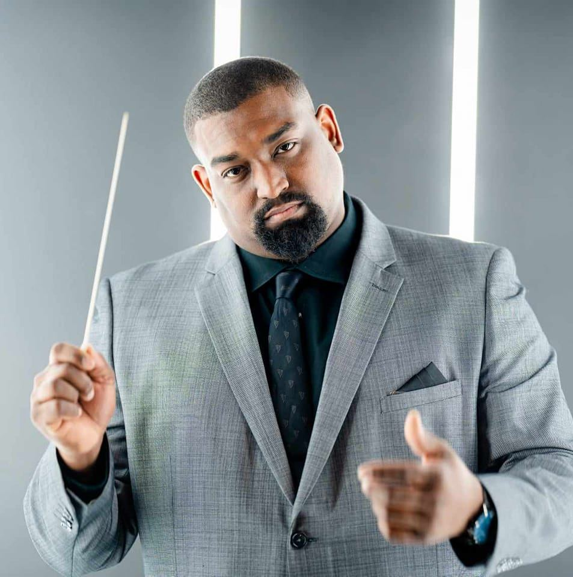

# About

Province 9 is a regional division of the Phi Mu Alpha Sinfonia Fraternity, located
in Central and South Texas. 

## Leadership
Leadership at the Province level is a mixture of appointed alumni and elective
active brothers. The Province Governor and Deputy Province Governor are appointed
by the National President. The Province Alumni Coordinator is then appointed by 
the Province Governor.

Because of the size of the Province, Province 9 has two dedicated Assistant Collegiate Province Representatives (ACPRs), one for the North and one for the South.

### Province Governor - Shawn Lewis
{: style="height:200px;width:200px" align=left}

Stuffity stuff

Stuffity stuff

Stuffity stuff

Stuffity stuff

Stuffity stuff

### Deputy Province Governor - Mason Egger
{: style="height:200px;width:200px" align=left}

Mason was initiated at Gamma Phi with 7 other brothers as part of the Epsilon 
Nu class in the Fall of 2012. During his time as an active he served on various
committees and was the Alumni Relations Officer twice; once as an active in 
2013-2014 and again as an alumni in 2016-2017. He graduated from Texas State
University in the Fall of 2015 with dual degrees in Computer Science and Music.

Mason is currently Sr. Technical Curriculum Developer at Temporal.io who 
specializes building community, developer-focused educational content, 
distributed systems, and Python. Prior to his work at Temporal he launched 
Developer Relations at Gretel.ai as the Lead Developer Advocate, and was a 
Developer Advocate at DigitalOcean specializing in Infrastructure-as-a-Service 
technologies. His engineering experience includes time as an Site Reliability
Engineer helping maintaining Expedia's cloud as well as a role working in 
Cyber Security for a Raytheon company. He's an avid programmer, speaker, 
educator, and writer/blogger. He is an organizer of the PyTexas Conference, 
Meetup, and is  President of the PyTexas Foundation. He actively contributes 
to open source projects, mostly surrounding PyTexas and the Python programming
language. In his spare time, he enjoys reading, camping, kayaking, and 
exploring new places.

### Province Alumni Coordinator - Chirs Silva
{: style="height:200px;width:200px" align=left}

Hello Brothers, 

I am Chris Silva, your Province Alumni Coordinator. I was
initiated in Fall 2006 at Kappa Chi at Del Mar College. At KX, I served as
FEO before transferring to TAMUCC with Rho Epsilon and serving as FEO
and as President. I also served one year as ACPR South. I didn’t graduate
from TAMUCC as I moved to San Antonio, but I eventually completed my
B.S. in Information Technology through an online institution. I landed a
job at Rackspace and worked until I landed my current job with A Cloud
Guru (A Pluralsight Company). I am part of the team that creates and
updates training content for AWS, Azure, and Google Cloud, along with
DevOps and Security. If you’re familiar with the company, you’ve heard my
voice and learned how to do various things across these disciplines from
my videos.

As a Collegiate Brother, I always enjoyed spending time with the Brothers and travelling around. I attended Leadership Institute twice (once in Nashville 
and once in Evansville) and National Convention 2009 in Orlando. Some of the 
best Brotherhood Development I’ve experienced has been in those 20+ hour car 
rides across the country! As your PAC, I hope to be a resource for the AROs in 
developing strong Alumnirelations. I was nervous but excited about the 
opportunity when Shawn asked me to be PAC. The Fraternity has had its fair 
share of setbacks over the last few years, and rebuilding trust and confidence 
in the organization within our Alumni base is of utmost importance as this 
body makes up the vast majority of the organization. I want to help the AROs 
develop strategies and create opportunities for strong Alumni engagement to 
rebuild trust and confidence in the organization and help rekindle Sinfonia’s 
fire within our Alumni Brothers. While my focus is on Alumni Relations, I am 
available as a resource to any Brothers in need. Please don’t hesitate to 
reach out if you need anything, have questions, or want to chat or get the
opinion of some old guy. 

_Fraternally, Chris Silva, KX ‘06 PAC_

### Collegiate Province Representative - Victor Briseno
{: style="height:200px;width:200px" align=left}

Hello Brothers! 

My name is Victor Briseño and I am a master’s student at Texas State University and an award-winning mariachi/opera vocalist hailing from Kingsville, TX. While pursuing my bachelor’s degree, I heard about Phi Mu Alpha, a fraternity aligned with my values and aspirations, and felt a strong calling to join. In the Spring of 2021, I crossed and joined the ranks of the distinguished Gamma Phi Chapter with the class of Zeta Zeta. Soon after, I adeptly fulfilled the roles and responsibilities of the Fraternal Education Officer (FEO), Assistant Fraternal Education Officer (AFEO), Treasurer, Fundraising Committee Head, and Brotherhood Committee Head. I have also, over my course of time, served on every committee in my chapter and actively work on increasing intraprovincial relationships by making lifelong friends in other chapters.

Recently acclaimed as the elected Chapter Province Representative (CPR) for Province 9, I stand poised to become a recognizable and approachable figurehead, a pillar of support and guidance for my fellow brothers and chapters. In this role, I envision amplifying the interactivity within the province, facilitating meaningful exchanges, building chapter leaders, solving looming or worrisome issues, and collaboratively charting the course for the province's collective journey beyond the challenges posed by the pandemic. I am beyond excited to work for the Province Council, but truthfully I am more enlivened by the mere fact that I get to serve the brothers of the prestigious and powerful Province 9. Please do not hesitate to reach out to me if there is anything I can do to help you or your chapters. You can find all my socials down below.

_On And Ever Upwards,_

_Victor M. Briseno - Collegiate Province Rep. of Province 9_

### Assistant Collegiate Province Representative (North) - Richard Daul

### Assistant Collegiate Province Representative (South) - Austin Catache

## History

## Past Leadership

### Past Governors

#### Robert Whalin: September 23, 1935 - May 9, 2023
{: style="height:400px;width:300px" align=left}

Dr. John Robert Whalin of San Marcos, Texas passed away on May 9, 2023. He was
born in Bloomington, Illinois on September 23, 1935. He was preceded in death 
by his parents, Oren Leslie Whalin and Pearle Dennison Whalin, and his sister 
Mary Lois Major. He is survived by his wife of 62 years, Mary Whalin; son
and daughter-in-law Brent and Dianna Whalin; daughter, Kimberly Whalin Lock; 
and his grandsons Gene, Ryan, Sean, and Jayce. Dr. Whalin,“Bob”, moved to San 
Marcos in 1964 to teach piano at Southwest Texas State University. During his 
tenure, he travelled extensively as a classical concert pianist. He was an 
active leader and province governor with Phi Mu Alpha Sinfonia for over 20 
years and received the Robert J. Rogers lifetime service award. He was also 
awarded the faculty senate award for excellence in teaching in 1990 and 1995. 
He retired in 2001 and went on to teach at Austin Community College for 10 
years and teach private lessons into his 80s. Bob was an active San Marcos 
Rotary Club member for 30 years. He was also the choir director at the 
Presbyterian church in New Braunfels, TX. He loved Austin Symphony concerts 
with his wife, hosting gatherings at their home in San Marcos, and attending 
his grandsons’ sports and music performances. He was a dedicated father and 
proud grandfather who would build an entire Christmas village in the den every 
year. He was loved and will be missed by so many.

#### Matthew Trevino
{: style="height:200px;width:200px" align=left}

Matthew Trevino is in his 14th year teaching elementary music, and his 9th 
year teaching the amazing students at Roan Forest Elementary. Trevino was a 
semifinalist for the 2018 and 2022 Music Educator GRAMMY and is currently on 
the GRAMMY race as a quarterfinalist for the 5th time. Since establishing his 
percussion group Sonido in 2015 the group Sonido was invited to perform at the 
opening ceremonies of the 2017 AOSA Conference in Fort Worth, Sonido was an 
“invited ensemble” for the 2020 TMEA Convention where they tore the roof off 
of the house! They have since performed at the Tobin Center, performed for 
STOMP! Performed for the Spurs, the San Antonio HS All Star Game at the 
Alamodome, and for countless other performances.

_#goroanforestgo_

